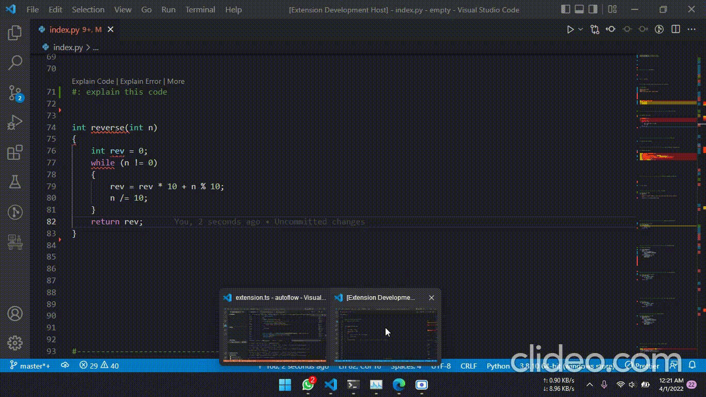

# Tutorial

## Installation

Clone this repository using git clone command.
cd into vs-code-extension and run `npm i`
Once installation is finished you can press `F5` and a new VS Code window with Autoflow running in it would be opened.

You also need to start the server to be able to test this.
Go to: [openai-autoflow](https://github.com/zShanCS/openai-autoflow) to do that.

## Intro

Autoflow is a VS Code Extension that improves developer workflow. It uses **OpenAI Codex**, **CodeT5**, **CodeBERT**, **MiniLM-L6-v2** and **CommitBERT**  for Code Generation and dozens of other features that makes life of a developer smooth and easy.

**IMPORTANT**: before using this extension, setup and start the FastAPI server in our [backend repo](https://github.com/zShanCS/openai-autoflow/tree/main)

## Features

Autoflow provides plenty of features which are listed below

1. **User Intent Analysis**
2. **Code Generation**
3. **Code Explanation**
4. **Documentation Generation**
5. **Generating SQL Queries from Natural Language Commands**
6. **Explaining SQL Queries**
7. **Automatic API Calls**
8. **Error Explanation**
9. **Bug Fixing**
10. **Create Function One Liners**
11. **Unit Tests Generation**
12. **Code Autocompletion**
13. **Refactoring Code**
14. **Detecting Vulnerabilities**
15. **Github Commit Message Generation**
16. **Code Semantic Search**

## Bridging the gap between User and Codex

User does not always know the best practices to use Codex. Codex can not understand the context of the query which creates a gap between user's need and code generation.

We have bridged this gap by creating custom templates. Users explain their need through easy commands and form inputs. We analyse these inputs and generate custom templates with certain keywords that are part of Codex best practices to generate accurate results.

    '''
    <comment start> Convert this function in <language> to a one line function<comment end>
    
    <function header>
    
    <code>
    
    <comment start><language> one line version<comment end>:
    
    <function header>
    
    <return statement>'''

## Intent Analysis

First and foremost problem is to understand the requirement of the developer. We have used Sentence Transformer (SBERT) model **MiniLM-L6-v2** to understand the intent of the user.
The user adds a comment prefixed with `#:` for python files and `//:` for other files then they are suggested the command for their intent in CodeLens. We also provide a more option which opens the command palette for the user.

## Codex Features

### Code Generation

Users provide description of the code to generate and that description is fed into Codex with optimal parameters that follow best practices.

**Usage**$$

- *Command:* Autoflow Magic
- *Input:*
  - Prefix with `#:` and write a short description of the task for which the user wants to generate code

### Code Explanation

User can select a code and asks for code explanation. It returns a paragraph that explains the code. An example is given below

### Document Generation

This feature provide more formal documentation of functions and classes. This includes a description of the input parameters, return values, and a step-by-step explanation of how the code block works.

**Usage**

- *Command:* Autoflow Make Doc String
- *Input:*
  - Prefix with `#:` and write a short description of the task and select the code for doc string generation

### Generating SQL Queries from Natural Language

User provides a list of tables, their respective column names, and short description of what task to perform. We return the SQL Query used to perform that task.

**Usage**

- *Command:* Autoflow Generate SQL
- *Input:*
  - List of table
  - List of columns
  - Task

### Explaining SQL Queries

User provides an SQL query and we generate a human readable explanation of what that query does and how it works.

**Usage**

- *Command:* Autoflow Explain SQL
- *Input:*
  - A basic SQL Query

### Automatic API Calls

If you don't want to read up on the documentation of how to write the request for a common API, just provide us the API name, the input prompt, and the required task that needs to be done. Optionally, users can provide an API Key.

We generate the code required to generate that request and parse its response.

**Usage**

- *Command:* Autoflow API Request
- *Input:*
  - Name of the API
  - Required Task
  - Prompt
  - API Key (Optional)

### Error Explanation

Have a piece of code and don't know what's wrong with it? Send us the piece of code and get a human readable explanation of what could be wrong with it.

**Usage**

- *Command:* Autoflow Explain Error
- *Input:*
  - Code

### Bug Fixing

Is your code not working properly? Send the code alongside an explanation of what it does. We will generate a fixed version of that code.

**Usage**

- *Command:* Autoflow Fix Bugs in Code
- *Input:*
  - Code

### Create Function One Liners

Want to convert a function into a one-liner version so that it can be used as a lambda function? Send the function and we'll generate a line version of that function if it exists.

**Usage**

- *Command:* Autoflow Make One Liner
- *Input:*
  - Code

### Unit Tests Generation

Unit testing is a tedious task. Provide a function and get a set of unit tests that can test your code for correctness.

**Usage**

- *Command:* Autoflow Make Unit Test
- *Input:*
  - Code

### Code Autocompletion

Not familiar with the syntax of the language and tired of downloading multiple extensions? Autoflow completes the code for you!

## CodeT5

### Code Refactoring and Refine

Code Refactoring is an important part of Software Development Life Cycle, but most of the developers find it boring and tedious. User can provide a piece of code and Autoflow will provide the refactored code for you.

**Usage**

- *Command:* Autoflow Fix/Refine Code
- *Input:*
  - Code

### Detecting Vulnerabilities

This feature uses **CodeT5** model and it detects the vulnerabilities in code. If there exist a vulnerability it returns a true otherwise false. This feature works best for C++. This is something which helps the developer to identify memory leaks or detect if the code can be improved

**Usage**

- *Command:* Autoflow Detect Defect in Code
- *Input:*
  - Code

## CommitBERT

### Github Commit Message Generation

Another exciting feature that Autoflow provides is that it can help you write a GitHub commit message. It compares the difference between the last commit and current changes in the file and predicts a commit message. This uses **CommitBert** model.

**Usage**

- *Command:*
  - `git diff > .autoflow`
  - Autoflow Recommend Commit
- *Input:*
  - Code

## CodeBERT

### Code Semantic Search

Want to find a function and unable to recall its name? Code Semantic Search does that for you. Give it a string explaining what you want to search and it searches for the function in the code base and return it in output.

**Usage**

- *Command:* Autoflow Search
- *Input:*
  - Description of what the user wants to search
